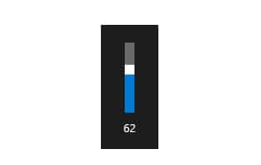
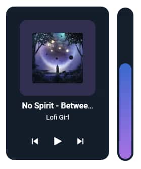
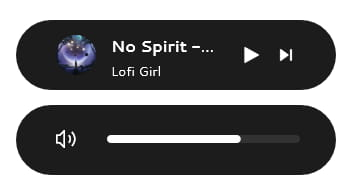
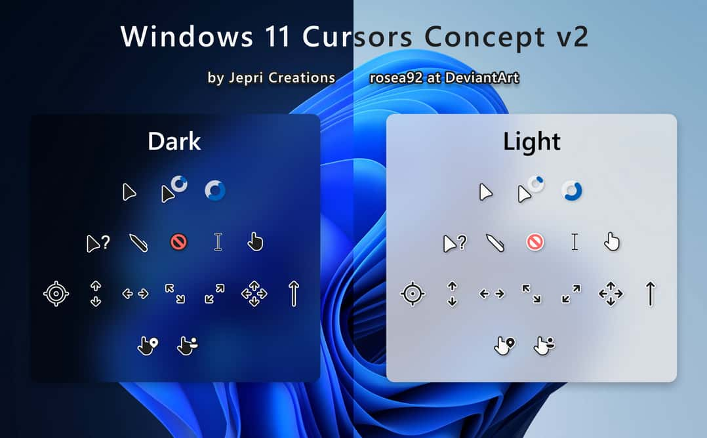
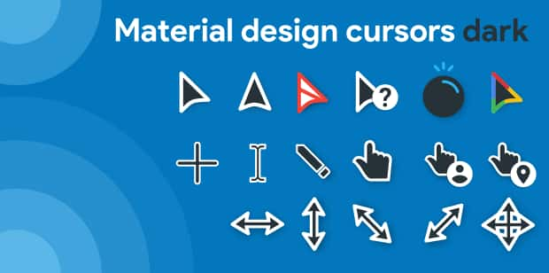

## Обои рабочего стола

Обои являются главной частью любого рабочего стола. Некоторые любят живые обои, а кто-то и просто статичные картинки.

### Живые обои

**Wallpaper engine**. Он прост, красив и имеет очень много разных тем, но является платным и не имеет открытого исходного кода.
Для установки вам необходим [Steam](https://store.steampowered.com/) (при установки программы не обязательно запускать Steam перед запуском программы). Напишите “Wallpaper engine” в поиске или нажмите [тут](https://store.steampowered.com/app/431960/Wallpaper_Engine/).

**Lively Wallpaper**. Бесплатный имеет открытый исходный код, но имеется всего ~12 стандартных тем при установке программы. Но погуглив можно [найти](https://www.google.com/search?q=lively+wallpaper+wallpapers) много тем для этой программы, которые можно установить, просто переместив видео файл в окно программы.
Скачать программу можно с [GitHub](https://github.com/rocksdanister/lively) или из [Microsoft Store](https://www.microsoft.com/store/apps/9NTM2QC6QWS7?cid=storebadge&ocid=badge).

### Меняющаяся по расписанию

**WinDynamicDesktop**. Он также открыт и позволяет плавно менять обои в зависимости от времени. После установки программы можно выбрать темы по умолчанию или же установить [другие](https://windd.info/themes/).
Скачать программу можно с [GitHub](https://github.com/t1m0thyj/WinDynamicDesktop) или из [Microsoft Store](https://www.microsoft.com/store/apps/9nm8n7dq3z5f?cid=storebadge&ocid=badge).

## Виджеты

**JaxCore**. Это тема для [Rainmeter](https://www.rainmeter.net/), которая добавляет очень много виджетов для рабочего стола и так же добавляет виджеты, заменяющий стандартный оверлей Windows.
К примеру музыки, когда медиа-клавишей переключаете текущий трек или прибавляете звук вы видите:

<figure>
    
    <figcaption>Шкала громкости Windows</figcaption>
</figure>

Если использовать 1 из виджетов JaxCore, то он будет выглядеть примерно так:

<figure>
    
    <figcaption>Шкала громкости в одной из тем JaxCore. Тема Ameber</figcaption>
</figure>

Или так:

<figure>
    
    <figcaption>Шкала громкости в одной из тем JaxCore. Тема Gnome</figcaption>
</figure>

В настройках можно кастомизировать практически все. Шрифт, акцентный цвет виджета, время анимации, задний фон и т.д.

## Панель задач

**RoundedTB**. При помощи данной утилиты можно закруглить стандартную панель задач Windows. Она бесплатна и ее можно скачать или в [Microsoft Store](https://apps.microsoft.com/store/detail/roundedtb/9MTFTXSJ9M7F?), либо на [GitHub](https://github.com/torchgm/RoundedTB)
Интерфейс данной программы очень прост и позволяет настроить панель задач как вам удобно.
Открыв программу, можно увидеть 2 ползунка первый отвечает за отступ со всех сторон, что позволяет сделать ее не только закругленной, но и придать эффект отступа снизу, вторым ползунком можно задать закругление панели, мои настройки 4, 8 и дает такой эффект:

<figure>
    
    <figcaption>Моя панель задач</figcaption>
</figure>

Но в интерфейсе RoundedTB есть кнопка "дополнительно", если нажать на нее, то мы увидим еще больше настроек.
"Динамический режим" открывает еще 2 чекбокса, если нажать на "Показывать панель задач Win + F2", то будет добавлена возможность показывать системный лоток справа, где находятся открытые программы, язык и время при нажатии Win + F2.
"Показывать трей при наведении". Делает тоже самое, что и "динамический режим", но не по нажатию Win + F2, а просто если навести в область трея.
Четвертый чекбокс дружит 2 программы RoundedTB и TranslucentTB, и которой пойдет речь в следующем параграфе.
Пятый чекбокс показывает всю панель задач когда любой приложение открыто в полный экран.
Шестой чекбокс делает то же, что и пятый, но показывает панель задач по нажатию Atl + tab, чтобы не оставался отсуп снизу при переключении вкладок.
P.S. Если вы хотите сделать выдвижение закругленной панели задач, то вам недостаточно просто указать это в настройках системы, в расширеных настройках отступ сверху сделайте на 0 а со всех остальных сторон нужный вам.

**TranslucentTB**. В данной утилите можно выбрать несколько тем для панели задач, которые добавляют на задний фон небольшое размытие и убирают затемнение.

## Курсоры

Скачать их можно, залогинившись через Google.

**Windows 11 Cursors Concept v2**.
[Скачать светлую и темную версию](https://www.deviantart.com/jepricreations/art/Windows-11-Cursors-Concept-v2-886489356).

**Material Design Cursors**
[Скачать темную версию](https://www.deviantart.com/jepricreations/art/Material-Design-Cursors-Dark-756850032)\
[Скачать светлую версию](https://www.deviantart.com/jepricreations/art/Material-Design-Cursors-Light-775995490)
